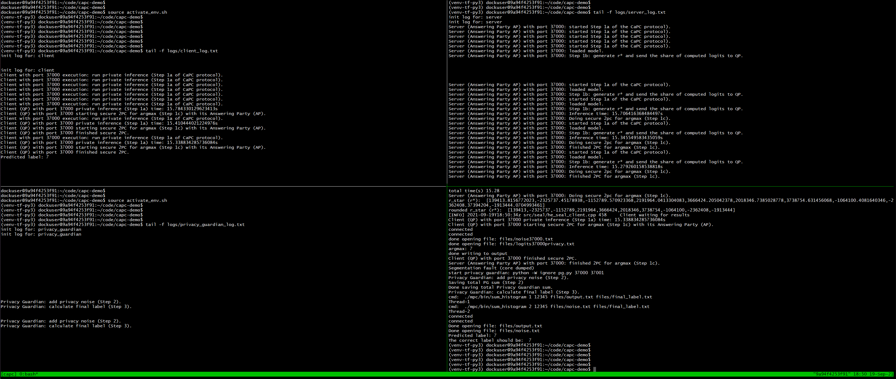

# CaPC

Minimal example of CaPC without a private inference.

Run server first: `server.py`
Then client: `client.py`

## CaPC Demo
Install the crypto packages.

```
wget https://raw.githubusercontent.com/emp-toolkit/emp-readme/master/scripts/install.py
python install.py -install -tool -ot -sh2pc
```

Then, make the cpp code:

```
cd mpc 
cmake .
make
```

Make sure libtmux is installed.

Train a cryptonets-relu.pb model and store it in `~/models/cryptonets-relu.pb`.

To run the protocol, follow method 1 (recommended), method 2 or method 3 as described below.

### Method 1 (Tmux and Terminal) 

One way to use the terminal is to use PyCharm and opening a SSH terminal there.
To do so, first create a configuration for a remote interpreter based on your
machine IP address and account. Then go to `Tools>Start SSH Session` to select the
host. The remote terminal will then automatically open.

To run the pipeline, run `tmux new -s capc` to open a new tmux session. Create 4
panes by first doing Ctrl+b followed by " to create two horizontally split panes and then Ctrl+b
followed by % to create the second and third panes, then do Ctrl+b and up-arrow, 
followed by Ctrl+b and % to create panes 0 and 3. The orientation of the panes will now be:

```
---0---|---1---
---2---|---3---
```

You can see the pane numbers by doing Ctrl+b and pressing q.

To switch between panes, use Ctrl+b and then the relevant arrow key
corresponding to the direction of the pane to switch to. For example to switch
from pane 1 to pane 2, use Ctrl+b followed by the right arrow key. To scroll up through the output of a pane, use Ctrl+b followed by the left square bracket. To type in the terminal again, press 'q'. 

Do `Ctrl+b q` to show number of panes. In pane 2, run `python init_log_files.py` to initialize the log files.

Go to pane 0 and let it show logs from `client.py`, run `tail -f logs/client_log.txt`
while pane 1 shows logs from the `server.py`, run in pane 1: `tail -f logs/server_log.txt`.
Pane 2 shows logs from the whole execution in `run_protocol.py` and 
the Privacy Guardian shows logs in pane 3, run in pane 3: `tail -f logs/privacy_guardian_log.txt`. 

Finally, go to pane 2, replace `X` in the code below with the number of answering parties. Not including n_parties will
lead to 1 party by default and run the main script:
```
python init_log_files.py
python run_protocol.py --n_parties X
```

Server and client complete Step 1 of the protocol including secure 2 party communication.
By default, the query will be the first item from the mnist test set. To change this, 
add the parameter `--start_batch Y` when running the experiment where Y is the index of
the test set to use. 

After Step 1, we run pg.py which consists of steps 2 and 3 of the
protocol. Here the PG will sum the s vectors and add Gaussian noise for DP (Step 2)
and the PG and querying party will then run Yao's garbled circuit to obtain the
final label (Step 3) which will also be outputted in Pane 1.


### Method 2 (Terminal)

Use a remote terminal to connect to the lab machine. Go to`cd ~/code/capc-demo` 
and activate the environment and HE-transformer library by running `source activate_env.sh`. Next run  

```
python run_protocol.py --n_parties X
```

Replace X with the number of answering parties. Not including n_parties will lead to 1 party by 
default. By default, the query used will be the first item from the mnist test set. To change this, add
the parameter `--start_batch Y` when running the script where Y is the index of the test set to use.

The program will automatically run the files `server.py` and `client.py` to complete step 1 of the CaPC protocol. After this it calls the privacy guardian
through the file `pg.py` to complete steps 2 and 3 of the protocol. 


### Method 3 (Jupyter Notebook)

Using SSH, log in to the lab machine and go to the directory ~/code/demo/capc.
Run the activate script to activate the Python environment and the HE
transformer library. Then start a jupyter notebook session with the command

```
On nic2: (venv-tf-py3) dockuser@nic2:~/code/demo/capc$ jupyter notebook
--no-browser --port=8080
```

Now create two ssh tunnels with the following commands to access the jupyter
notebook from your local pc.

```
a) ssh -f -N -L 127.0.0.1:3320:10.6.10.132:22 username@q.vectorinstitute.ai;

b) ssh -f -N -L 8080:localhost:8080 dockuser@127.0.0.1 -p 3320
```

Use `localhost:8080` to open the Jupyter server on your local browser. Enter the
token provided when the notebook session was initially set up.

To run the experiment, open the notebook run_experiment.ipynb and start by
setting the number of parties at the start of the notebook and the index of the
mnist test set to use as the query item. 

Run the cells to start the protocol. After the initial imports and setup required, 
one cell will run step 1 by calling `server.py` and `client.py` and the next will then run steps 2 and 3 
by calling `pg.py`. The final predicted label as well as the actual label will be outputted by the last cell
of the notebook. 


### Outputs

The output files produced by the program will be saved in the folder "files" and
the logs will be saved in the folder "logs" with the appropriate timestamp.

  {#fig:capc-demo-example}
